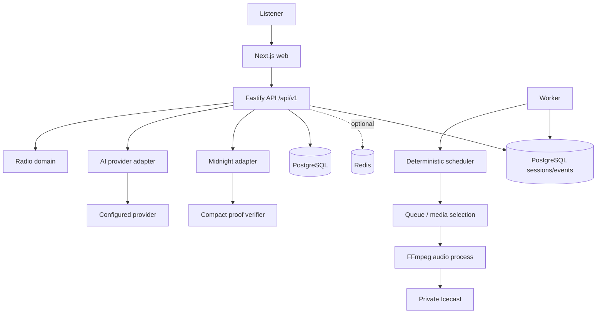

# BlockTek Radio

BlockTek Radio is a privacy-preserving, decentralized radio protocol for community programming, independent media, and contributor-led broadcasting. Its product loop is simple: listen, discover, contribute, verify eligibility privately, review editorially, and broadcast.

> **Status (verified 2026-09-06):** Phase 1 is live in production and Phase 2 remains deployed. Phase 3A is complete. Phase 3B live Preprod acceptance is complete: the protected wallet generated usable tDUST, the Compact contract was deployed, and its `attest` circuit produced a finalized ZK transaction whose public ledger state was verified through the Preprod indexer. The application adapter remains `NOT_CONFIGURED` until a separately hosted verifier HTTP service and production authentication integration are enabled.

## Vision and Problem

Creators, journalists, listeners, and communities need media infrastructure that is not dependent on a single platform or forced to reveal more identity than a contribution requires. BlockTek Radio combines radio programming, AI assistance, community contribution, and Midnight eligibility proofs while keeping continuous media off-chain.

The project does not make an absolute anonymity claim. Browsers, network infrastructure, upload systems, and stream providers can still expose metadata unless those systems are separately controlled.

## Current Status

Phase 1B extends the Phase 1 foundation with a private Icecast source boundary, a deterministic FFmpeg worker, persistent broadcast sessions/events, filesystem media management, fallback handling, and real now-playing synchronization. Phase 2 adds deployed AI programming with durable decision and queue records. The production instance is configured at `https://blocktek-radio.duckdns.org`; the Vercel frontend is `https://blockteck-radio.vercel.app/`.

The API uses PostgreSQL when `DATABASE_URL` is configured and an in-memory repository for host development. Production AI uses server-side ASI Cloud and Groq credentials; host development without provider credentials uses an explicitly labelled deterministic fallback. `RADIO_STREAM_URL` remains optional. The application reports Midnight as `NOT_CONFIGURED` until its verifier service is reachable; the separate operator acceptance runner does not make that claim on behalf of the API. No proof, transaction, live stream, provider result, or now-playing metadata is fabricated.

## Why Midnight

Midnight is the privacy boundary for contributor credentials, eligibility assertions, and selective disclosure. The intended result is to prove “verified contributor” or another eligibility property without revealing name, email, location, wallet address, or organisation. Audio, podcasts, stream data, AI processing, and ordinary application data remain off-chain.

## Phase 3 — Private + Verifiable Radio

Phase 3 adds a server-authoritative contribution lifecycle without making
Midnight a dependency of radio uptime:

```text
Contributor -> commitment -> real Midnight proof (when configured)
  -> selective disclosure -> editorial review -> approval
  -> programmable metadata -> existing AI validator -> queue -> broadcast
```

The API persists `DRAFT`, `SUBMITTED`, `PRIVACY_VERIFICATION_PENDING`,
`PRIVACY_VERIFIED`, `EDITORIAL_REVIEW`, `APPROVED`, `PROGRAMMABLE`, and
`BROADCAST`, plus `REJECTED`, `EXPIRED`, and `REVOKED`. New contributions remain
pending when Midnight is unavailable; existing radio media and the broadcast
worker continue independently.

### Privacy model

| Classification | Examples | Stored/exposed by BlockTek |
| --- | --- | --- |
| Private | identity, contact details, wallet secrets, proof inputs, witnesses | Not accepted by the contribution API and never sent to AI |
| Selectively disclosed | eligibility result, category, ownership claim | Only the attributes returned by a verified adapter |
| Public/editorial | contribution ID, title, description, content type, commitment, lifecycle state | Owner/editor scoped API views; approved metadata may reach AI |

The commitment is SHA-256 over a canonical, recursively key-sorted JSON
representation of content type, normalized title/description, content
reference, and metadata. The same canonical input is deterministic; changing
bound metadata changes the commitment. Audio is never put on-chain.

`contracts/midnight/contributor-eligibility.compact` is the minimal contract
source. It initializes public contributor and eligibility commitments, checks
private witness equality during `attest`, exposes only commitments plus
verification/revocation flags, and keeps audio off-chain. The generated
artifacts are in `packages/midnight/managed/` and are documented with their
toolchain provenance. They prove compilation and simulator behavior only; the
contract is not claimed as deployed and the API remains `NOT_CONFIGURED` until
live network and verifier evidence exists.

The current adapter boundary supports a separately hosted verifier through
`MIDNIGHT_VERIFIER_URL`; that service must own Midnight.js providers, proof
artifacts, wallet approval, and transaction submission. BlockTek does not
store seed phrases/private keys, sign on behalf of contributors, or accept raw
witnesses. The operator acceptance runner has verified the live Preprod
deployment and proof independently; until this HTTP boundary is configured,
`/api/v1/midnight/status` and `/midnight` still report `NOT_CONFIGURED` and
API proof requests do not advance state.

### Privacy API

Protected contribution routes are available at `POST/GET /api/v1/contributions`,
`POST /api/v1/contributions/:id/prove-eligibility`,
`GET /api/v1/contributions/:id/privacy-status`,
`POST /api/v1/contributions/:id/editorial-review`, and
`POST /api/v1/contributions/:id/approve`. `GET /api/v1/midnight/status` exposes
only aggregate counts and safe adapter state; verification details omit the
proof reference from contributor responses. Editorial approval requires an
`EDITOR` or `ADMIN` actor, and contributors can read only their own records.

The checkout has no production authentication provider. Development tests and
the local demo use explicitly labelled actor headers under
`BLOCKTEK_AUTH_MODE=development`; production defaults to
`BLOCKTEK_AUTH_MODE=unconfigured` and returns `503` for private contribution
operations until the existing trusted authentication/proxy integration is
connected. These headers are not an identity system.

### AI boundary

AI receives only enabled media and `programmable()` contribution metadata:
contribution ID, content type, title, description, verified editorial status,
programming eligibility, and an optional content reference. It never receives
identity, contact information, wallet material, proof references, or witness
data. Deterministic validation remains authoritative and Midnight outages do
not stop the worker or live stream.

## What Works Today

- `/radio` provides the station, channel, programme, queue, and now-playing product shell.
- `/radio` includes native audio playback controls with explicit stream-health, error, retry, volume, and API-unavailable states.
- `/ai-dj` provides a schema-validated programme-generation workflow with a server-side provider boundary.
- `/ai-dj` reports the live AI status, programming mode, provider metadata, generated programme provenance, and decision explanation without exposing credentials.
- `/contribute` provides metadata-only contribution intake, commitment generation, and honest proof-request status.
- `/midnight` exposes verified adapter configuration and aggregate privacy lifecycle counts; `/verify` explains selective disclosure.
- The versioned Fastify API exposes health, radio read models, AI programme generation, durable contributions, editorial review, and verification status.
- Shared TypeScript packages contain domain types, Zod validation, radio queue rules, AI adapters, and the Midnight integration boundary.
- Docker Compose runs isolated web, API, worker, PostgreSQL, Redis, and Icecast services with loopback-only web/API bindings; API startup applies the radio migrations.
- The worker discovers operator-managed media, applies deterministic queue/programme selection, streams through FFmpeg to private Icecast, persists broadcast sessions/events, and shuts down cleanly.
- Production media is discovered from the seven supplied MP3 files in `media/music/`; FFmpeg uses their probed durations for track transitions and Icecast source metadata identifies `BlockTek Radio`.
- The public HTTPS stream at `/stream` proxies privately to Icecast `/live`; the public API reports the same canonical listener URL and current persisted broadcast item.
- AI-generated windows are persisted in PostgreSQL, claimed by the BlockTek worker, played through FFmpeg, and recorded as real broadcast events. The deployed queue has been verified in `PENDING`, `PLAYING`, and `PLAYED` states.
- The production CORS policy allows the exact Vercel origin for API and stream requests; no server credentials are exposed to the browser.
- Empty or invalid media does not produce a false `LIVE` state. Operators can explicitly enable a generated 440 Hz test tone for internal stream checks.

## Architecture



The web client owns presentation and interaction. API routes own validation, orchestration, authorization boundaries, and integration status. Domain packages contain reusable rules and schemas. The API selects a PostgreSQL repository when `DATABASE_URL` is configured and otherwise uses a clearly bounded in-memory development repository. Redis is provisioned but optional; it is not the durable source of radio state.

### Core Data Flow

```text
Listen -> Discover -> AI DJ request -> Validated programme
  -> Private contribution -> Eligibility proof -> Selective disclosure
  -> Editorial review -> Approved broadcast -> Listen
```

The first radio read model is:

```text
Station -> Channel -> Programme -> Queue -> Now Playing
```

Media and streams remain off-chain. AI providers are selected server-side and must return schema-validated data. Midnight is an adapter boundary that cannot verify a proof until a real Compact contract and verifier are configured. Private contributor intake requires the production authentication/proxy integration, encryption/retention policy, and rate limits before production enablement. The current durable schema stores commitments/references and status, never raw witnesses or wallet secrets.

## Structure

```text
app/                       Next.js routes
components/                Web presentation and product consoles
apps/api/                  Fastify API
apps/worker/               Deterministic scheduler and FFmpeg broadcast worker
packages/types/            Shared schemas and domain types
packages/radio-core/       Playlist and queue rules
packages/ai/               AI provider abstraction
packages/midnight/         Midnight adapter boundary
contracts/midnight/        Compact integration boundary
infrastructure/docker/     Production container definitions
infrastructure/nginx/      BlockTek reverse-proxy configuration and disabled template
media/                     Operator-managed audio mount; media is not committed
```

## Local Development

```bash
pnpm install
cp .env.example .env
pnpm dev
pnpm dev:api
```

Open `http://localhost:3000`. The API is available at `http://localhost:4000`. Without a configured public API or stream, the web application deliberately displays `API UNAVAILABLE` or `NOT CONFIGURED`.

### Phase 3B local operator setup

The current Midnight toolchain is installed from the official Compact
installer. The generated contract artifacts are reproducible with:

```bash
compact update 0.31.1
compact compile contracts/midnight/contributor-eligibility.compact packages/midnight/managed
```

The preprod wallet bootstrap requires Node.js `>=24.11.1` and writes its
development-only seed to `/etc/blocktek-radio/midnight-wallet.env` with mode
`0600`; it prints only public address and balance:

```bash
npx --yes --package node@24.11.1 --package tsx@4.20.5 \
  tsx packages/midnight/scripts/bootstrap-testnet-wallet.ts
```

Use the official preprod faucet UI to obtain a real Turnstile response before
passing `MIDNIGHT_FAUCET_CAPTCHA_TOKEN` to the optional `--faucet` operation.
The token is transient input and must not be committed or logged. Contract
deployment uses the current wallet SDK WebSocket submission path by default;
set `MIDNIGHT_RPC_SUBMISSION_MODE=http` only to test the legacy HTTP fallback.
The optional `--generate-dust` operation follows the official tNIGHT-to-tDUST
registration flow and reports the DUST state without printing wallet secrets.

After the deployment readiness gate is true, the real deployment and proof
acceptance commands are:

```bash
npx --yes --package node@24.11.1 --package tsx@4.20.5 \
  tsx packages/midnight/scripts/deploy-contributor-eligibility.ts

npx --yes --package node@24.11.1 --package tsx@4.20.5 \
  tsx packages/midnight/scripts/verify-contributor-eligibility.ts
```

The operator supplies `MIDNIGHT_STORAGE_PASSWORD` out-of-band. Neither
command prints it or stores it in Git. The verifier reuses an already
finalized `attest` result when the public ledger state matches, preventing an
unnecessary duplicate proof transaction.

## Environment Variables

See `.env.example`. Browser-safe configuration is limited to `NEXT_PUBLIC_API_BASE_URL`. Provider keys, database URLs, authentication secrets, Midnight URLs, and stream configuration are server-side only.

## Broadcast configuration and Docker

The production-shaped Compose project is named `blocktek-radio` and uses `blocktek-radio-network`. Web and API bind only to loopback ports `3010` and `4010`; PostgreSQL, Redis, Icecast, and the worker remain private to the BlockTek network.

```bash
cp .env.example .env
chmod 600 .env
docker compose config
docker compose up -d --build
docker compose ps
```

To enable broadcasting, set `RADIO_BROADCAST_ENABLED=true`, provide Icecast source credentials, set `RADIO_PUBLIC_STREAM_URL`, and place owned/licensed audio below `media/`. For an internal no-copyright test, also set `RADIO_TEST_TONE_ENABLED=true`. Keep the test tone disabled in production.

Media is mounted from the dedicated BlockTek path `/opt/blocktek-radio/media` and organized as:

```text
media/{music,programmes,podcasts,jingles,fallback,generated}/
```

The worker scans supported files in deterministic filename order, loops the FFmpeg playlist continuously, and uses fallback media when the scheduled queue has no playable item. Missing media produces `NO MEDIA CONFIGURED` and leaves the station offline.

`docker-compose.dev.yml` starts only project-scoped PostgreSQL and Redis for local dependency work. Only BlockTek-owned database, Redis, provider, stream, authentication, Icecast, and Midnight configuration belongs in `.env`.

## Production URLs and operations

The verified production topology is:

```text
https://blockteck-radio.vercel.app/
        -> https://blocktek-radio.duckdns.org/api/v1/...
        -> 127.0.0.1:4010 -> Fastify API

https://blocktek-radio.duckdns.org/stream
        -> 127.0.0.1:8000/live -> private Docker Icecast
```

The canonical public stream URL is `https://blocktek-radio.duckdns.org/stream`; the internal Icecast mount remains `/live`. The BlockTek Compose services are `web`, `api`, `worker`, `postgres`, `redis`, and `icecast`. Web, API, and Icecast publish only loopback ports `3010`, `4010`, and `8000`; PostgreSQL and Redis have no host port publication.

Production configuration uses `NEXT_PUBLIC_API_BASE_URL=https://blocktek-radio.duckdns.org` (the existing client convention expects an origin and appends `/api/v1/...`), `WEB_BASE_URL=https://blockteck-radio.vercel.app`, `RADIO_PUBLIC_STREAM_URL=https://blocktek-radio.duckdns.org/stream`, `RADIO_STREAM_ENABLED=true`, and `RADIO_BROADCAST_ENABLED=true`. `ICECAST_CORS_ORIGIN` is restricted to the Vercel origin. Secret values remain only in the root `.env`, which must stay mode `0600` and must never be committed.

The dedicated Nginx file is `infrastructure/nginx/blocktek-radio.duckdns.org.conf`. It redirects HTTP to HTTPS, serves the ACME challenge, proxies `/api/` to Fastify, proxies only `/stream` to Icecast `/live`, and sends other website traffic to the local Next.js service. PostgreSQL, Redis, and Icecast administration are not public routes. The VPS certificate is issued by Let's Encrypt and is renewed by Certbot.

Useful operator commands:

```bash
chmod 600 .env
docker compose config
docker compose up -d --build
docker compose ps
docker compose logs --tail=100 worker icecast api
curl -fsS https://blocktek-radio.duckdns.org/api/v1/health
curl -fsS https://blocktek-radio.duckdns.org/api/v1/radio/status
curl -fsS https://blocktek-radio.duckdns.org/api/v1/radio/now-playing
```

For controlled recovery, restart only the affected BlockTek service: `docker compose restart worker` or `docker compose restart icecast`. The worker is configured to exit when FFmpeg loses Icecast so Docker can restart it and establish a fresh persisted session. If the stream is `OFFLINE`, first check `docker compose ps`, worker/Icecast logs, the media bind path, and `RADIO_BROADCAST_ENABLED`; never enable the test tone as a production substitute for real media.

## Tests and API

```bash
pnpm test
pnpm build:api
pnpm build
```

All application routes are versioned under `/api/v1`.

Endpoints currently include:

- `GET /api/v1/health`
- `GET /api/v1/health/ready`
- `GET /api/v1/radio/stations`
- `GET /api/v1/radio/channels`
- `GET /api/v1/radio/now-playing`
- `GET /api/v1/radio/status`
- `GET /api/v1/radio/stream`
- `GET /api/v1/radio/queue`
- `GET /api/v1/radio/programmes`
- `GET /api/v1/radio/schedule`
- `POST /api/v1/ai/programmes`
- `POST /api/v1/submissions`
- `GET /api/v1/submissions/:id`
- `POST /api/v1/submissions/:id/transitions`
- `GET /api/v1/midnight/status`
- `GET /api/v1/verification/disclosure`

`/api/v1/radio/status` reports configured, reachable, worker, Icecast, listener, and current-item state without returning passwords or source credentials. `LIVE` requires a configured reachable listener stream; `OFFLINE`, `CONNECTING`, and `NOT_CONFIGURED` remain explicit states.

## Security Model

The contribution flow is development-only and currently lacks authentication, encryption, evidence storage, rate limiting, and durable persistence. Do not submit real sensitive information. The intended disclosure policy reveals eligibility only and hides name, email, location, wallet, organisation, and other identity fields. Editorial review remains a human-controlled boundary for allegations, moderation, and approval to broadcast.

Icecast source, admin, relay, database, Redis, and provider credentials are server-side only. The browser receives only the public listener URL and API read models. Icecast is not directly public: the route is `radio domain -> Nginx -> private Icecast`, with the API routed separately. API CORS is limited to `https://blockteck-radio.vercel.app`; the stream response uses the same exact origin rather than a wildcard.

## Deployment

BlockTek Radio runs as an isolated application stack on a shared VPS. Docker Compose uses its own project/network namespace, loopback-only web/API/Icecast bindings, bounded worker/Icecast resources, and private PostgreSQL/Redis services without reusing existing tenant-owned dependencies. `blocktek-radio.duckdns.org` resolves to `89.116.31.3`, and the dedicated Nginx virtual host terminates the Let's Encrypt certificate and provides the API/stream routes. The Vercel production environment contains only the public `NEXT_PUBLIC_API_BASE_URL` value.

## Roadmap

### Completed: Phases 0, 0.5, 1, and 1B

Foundation, isolated VPS/Compose boundaries, PostgreSQL radio persistence, schedule/queue APIs, native browser playback, private Icecast, FFmpeg continuous audio, deterministic scheduling, filesystem media management, fallback/test tone, duration-aware real-media transitions, durable broadcast sessions/events, health/readiness reporting, public Nginx/TLS routing, Vercel API configuration, and real now-playing synchronization are implemented and externally verified.

### Ongoing: Phase 1 operational hardening

Add operator-supplied fallback/jingle audio to the currently empty fallback directories, formalize backups and log retention, and add external uptime/stream monitoring. The primary seven-file licensed/project-owned music library is already active. Keep browser Play verification in the release checklist after frontend changes.

### Completed: Phase 2 AI DJ & Intelligent Programming

The deployed AI pipeline is `bounded broadcast context -> ASI Cloud -> Groq fallback -> strict JSON/schema validation -> media allowlist/cooldown policy -> PostgreSQL decision and queue -> worker -> FFmpeg -> private Icecast`. Provider keys remain server-side and are never returned by the API. The primary environment names are `ASI_CLOUD_BASE_URL`, `ASI_CLOUD_CHAT_MODEL`, `ASI_CLOUD_API_KEY2`; fallback uses `GROQ_API_KEY` and `GROQ_MODEL`.

Programming modes are `DETERMINISTIC`, `AI_ASSISTED`, and `AI_PROGRAMMED`; production is currently configured as `AI_ASSISTED`. All modes retain deterministic eligibility, duplicate, cooldown, duration, and fallback rules. AI generates bounded multi-track windows rather than controlling FFmpeg or executing tools. The additive migration `0002_ai_programming.sql` creates `ai_programming_decisions` and `ai_programming_queue`. Accepted items are inserted into the durable queue; the BlockTek worker claims those items before deterministic media and marks them played. If both providers fail, the worker continues with the normal catalogue loop.

The `/ai-dj` route reports actual API state and labels fallback/demo output. The API exposes `GET /api/v1/ai/status`, `POST /api/v1/ai/playlist`, `POST /api/v1/ai/programmes`, `GET /api/v1/ai/decisions`, and `GET /api/v1/ai/decisions/:id`. Generated DJ text/TTS is not required for the core broadcast and no fake audio is produced. Live chain acceptance for Midnight/ZK eligibility is complete; the verifier-backed application flow remains Phase 3B work.

### Completed: Phase 3A — Privacy Lifecycle & Selective Disclosure

Phase 3A establishes the server-authoritative privacy layer without making
Midnight a dependency of radio uptime. Implemented and verified capabilities
include:

- Durable contributor, contribution, privacy-verification, editorial-review,
  Midnight transaction, and audit-event records through migration
  `0003_privacy.sql`.
- Ordered lifecycle states from `DRAFT` and `SUBMITTED` through privacy
  verification, editorial review, approval, programming, broadcast, rejection,
  expiry, and revocation.
- Canonical SHA-256 content commitments with audio remaining off-chain.
- Selective-disclosure boundaries that expose eligibility results only; private
  identity data, wallet secrets, proof inputs, and witnesses are not accepted
  by the API or sent to AI.
- A minimal Compact eligibility contract source and a clean Midnight verifier
  adapter boundary. The contract is compiled and has now been deployed and
  exercised on Preprod; the live application still reports `NOT_CONFIGURED`
  until its separate verifier HTTP service is enabled.
- Owner/editor authorization boundaries, editorial approval, audit history,
  approved-metadata handoff to the existing AI programming context, and the
  `/contribute` and `/midnight` interfaces.

### Phase 3B — Live Midnight Testnet Integration

Implemented and verified in the repository:

- Official Compact devtool `0.5.2` with compiler `0.31.1`, Compact language
  `0.23.0`, ledger `8.0.2`, and runtime `0.16.0`; generated JavaScript,
  declarations, ZKIR, and prover/verifier artifacts are retained under
  `packages/midnight/managed/`.
- Midnight.js `4.1.1`, Wallet SDK `1.2.0`, pinned ledger/runtime dependencies,
  and the official Node.js `>=24.11.1` requirement used by the current example
  ecosystem.
- A protected preprod wallet bootstrap that stores its seed outside Git with
  mode `0600`, prints only the public address and balance, and requires a real
  Turnstile token before attempting the official faucet request.
- A BlockTek-only proof server pinned to `8.1.0` and bound to loopback; radio
  services do not depend on it for uptime. Compact simulator tests cover
  commitment initialization, witness mismatch rejection, attestation, and
  revocation.

Verified on Preprod on 2026-09-06:

- The deployment readiness gate was true for healthy node/indexer/proof
  providers, synchronized wallet state, registered tNIGHT UTxOs, synchronized
  DUST, nonzero usable tDUST, valid artifacts, and encrypted private-state
  storage.
- Contract address:
  `00dbd210a79269590e962745cd19f47e35cf66451390c2c0eee617269d847d58`.
- Deployment transaction reference:
  `009d1adb6545e8927cb0af9b3f991560ca62798fdb436b6a622f94b0f5e71e280d`,
  included at Preprod block `2434918`.
- The real `attest` circuit generated and submitted a ZK transaction. The
  Preprod indexer returned `verified=true`, `revoked=false`, and the expected
  public content commitment for verification transaction
  `5f60074361afac840f7e3a8781eda1835a1865788ee450ae20502685babad8fb` at
  block `2435060`.
- The current Preprod node rejected the legacy HTTP submission fallback with
  HTTP 403; the supported operator flow therefore uses the Midnight.js wallet
  WebSocket submission path (`MIDNIGHT_RPC_SUBMISSION_MODE=ws`).
- Redacted readiness, deployment, and verification records are retained on
  the operator host under `/etc/blocktek-radio/`; wallet seed, private state,
  signing keys, and passwords are not committed.

The remaining Phase 3B application-integration steps are:

- Wire a separately hosted Node 24 Midnight.js verifier/provider service to
  `MIDNIGHT_VERIFIER_URL`; the API must call that service rather than accept
  wallet seeds, witnesses, or raw proof material.
- Exercise the API-level invalid-proof, expiry, revocation, ownership, and
  editorial-transition paths against that real verifier, recording only safe
  verification references.
- Complete the production authentication integration and authenticated live
  contribution-to-editorial-to-AI-to-broadcast checks.
- Deploy the frontend only after the verifier-backed API is configured; this
  acceptance update changes no frontend source and does not require a new
  Vercel deployment.

The live chain acceptance blocker is resolved. Phase 3B remains an application
integration phase until the verifier service and production authentication are
enabled. Radio playback, the existing AI fallback behavior, and the broadcast
worker remain operational if Midnight is unavailable. Phase 4 remains out of
scope until the remaining Phase 3B application gates are complete.

### Phase 4: Whistleblower Workflow

Add encrypted evidence, private submissions, verification, editorial states, moderation, audit logs, and approval-to-broadcast integration.

### Phase 5: Autonomous Radio

Add AI scheduling, listener preferences, curation, intelligent transitions, and a live AI DJ with human override.

### Phase 6: Midnight Ecosystem

Explore Midnight-native deployment, Midnight City integration, in-world radio, agent interactions, and a contributor ecosystem without making those dependencies for the MVP.

## Contribution and License

Keep API and domain logic outside UI components, validate external data, preserve real-versus-development status labels, and add tests for stateful or security-sensitive behavior. Changes that enable real intake, sending, broadcasting, provider calls, or blockchain transactions require explicit configuration and review.

## License

The original product specification identifies the project as MIT-licensed. Add the root `LICENSE` file before treating the public repository as formally licensed.
