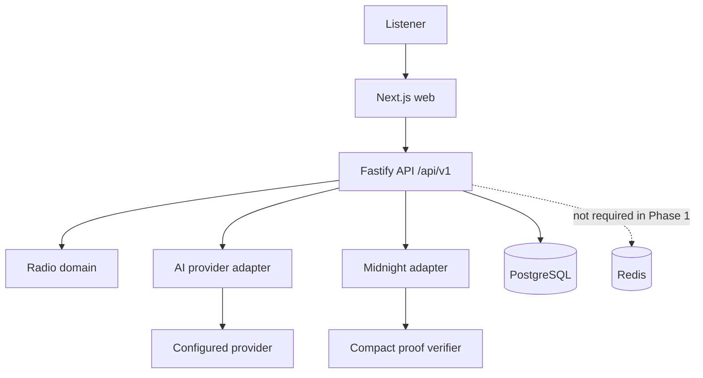

# BlockTek Radio

BlockTek Radio is a privacy-preserving, decentralized radio protocol for community programming, independent media, and contributor-led broadcasting. Its product loop is simple: listen, discover, contribute, verify eligibility privately, review editorially, and broadcast.

> **Status:** Phase 1 radio foundation. The repository contains an executable product shell, a PostgreSQL-backed radio repository, a native browser player, and explicit stream health states. A real stream source, configured AI provider, and Midnight proofs are not enabled yet.

## Vision and Problem

Creators, journalists, listeners, and communities need media infrastructure that is not dependent on a single platform or forced to reveal more identity than a contribution requires. BlockTek Radio combines radio programming, AI assistance, community contribution, and Midnight eligibility proofs while keeping continuous media off-chain.

The project does not make an absolute anonymity claim. Browsers, network infrastructure, upload systems, and stream providers can still expose metadata unless those systems are separately controlled.

## Current Status

Phase 1 is implemented on top of the Phase 0 foundation. The repository includes shared radio domain contracts, deterministic queue and schedule rules, Drizzle/PostgreSQL persistence with an initial migration, stream reachability checks, structured radio APIs, and a native browser audio player.

The API uses PostgreSQL when `DATABASE_URL` is configured and an in-memory repository for host development. `RADIO_STREAM_URL` is optional, AI uses an explicitly labelled development fallback without provider credentials, and Midnight reports `NOT_CONFIGURED`. No proof, transaction, live stream, provider result, or now-playing metadata is fabricated.

## Why Midnight

Midnight is the privacy boundary for contributor credentials, eligibility assertions, and selective disclosure. The intended result is to prove “verified contributor” or another eligibility property without revealing name, email, location, wallet address, or organisation. Audio, podcasts, stream data, AI processing, and ordinary application data remain off-chain.

## What Works Today

- `/radio` provides the station, channel, programme, queue, and now-playing product shell.
- `/radio` includes native audio playback controls with explicit stream-health, error, retry, volume, and API-unavailable states.
- `/ai-dj` provides a schema-validated programme-generation workflow with a server-side provider boundary.
- `/contribute` provides a development-only contribution workflow and editorial state transitions.
- `/verify` exposes Midnight configuration status and a selective-disclosure policy.
- The versioned Fastify API exposes health, radio read models, AI programme generation, submissions, and verification status.
- Shared TypeScript packages contain domain types, Zod validation, radio queue rules, AI adapters, and the Midnight integration boundary.
- Docker Compose runs isolated web, API, PostgreSQL, and Redis services with loopback-only web/API bindings; API startup applies the radio migration.

## Architecture



The web client owns presentation and interaction. API routes own validation, orchestration, authorization boundaries, and integration status. Domain packages contain reusable rules and schemas. The API selects a PostgreSQL repository when `DATABASE_URL` is configured and otherwise uses a clearly bounded in-memory development repository. Redis is provisioned but not required for Phase 1 reads.

### Core Data Flow

```text
Listen -> Discover -> AI DJ request -> Validated programme
  -> Private contribution -> Eligibility proof -> Selective disclosure
  -> Editorial review -> Approved broadcast -> Listen
```

The first radio read model is:

```text
Station -> Channel -> Programme -> Queue -> Now Playing
```

Media and streams remain off-chain. AI providers are selected server-side and must return schema-validated data. Midnight is an adapter boundary that cannot verify a proof until a real Compact contract and verifier are configured. Private contributor intake requires authentication, encryption, rate limits, durable storage, access control, retention rules, and metadata minimization before production enablement.

## Structure

```text
app/                       Next.js routes
components/                Web presentation and product consoles
apps/api/                  Fastify API
packages/types/            Shared schemas and domain types
packages/radio-core/       Playlist and queue rules
packages/ai/               AI provider abstraction
packages/midnight/         Midnight adapter boundary
contracts/midnight/        Compact integration boundary
infrastructure/docker/     Production container definitions
infrastructure/nginx/      Disabled reverse-proxy template
```

## Local Development

```bash
pnpm install
cp .env.example .env
pnpm dev
pnpm dev:api
```

Open `http://localhost:3000`. The API is available at `http://localhost:4000`.

## Environment Variables

See `.env.example`. Browser-safe configuration is limited to `NEXT_PUBLIC_API_BASE_URL`. Provider keys, database URLs, authentication secrets, Midnight URLs, and stream configuration are server-side only.

## Docker

The production-shaped Compose project is named `blocktek-radio` and uses `blocktek-radio-network`. Web and API bind only to loopback ports `3010` and `4010`; PostgreSQL and Redis have no published host ports.

```bash
cp .env.example .env
chmod 600 .env
docker compose config
docker compose up -d --build
docker compose ps
```

`docker-compose.dev.yml` starts only project-scoped PostgreSQL and Redis for local dependency work. M0 has no database migration because it has no durable application repository yet. Only BlockTek-owned database, Redis, provider, stream, authentication, and Midnight configuration belongs in `.env`.

## Tests and API

```bash
pnpm test
pnpm build:api
pnpm build
```

All application routes are versioned under `/api/v1`.

Endpoints currently include:

- `GET /api/v1/health`
- `GET /api/v1/health/ready`
- `GET /api/v1/radio/stations`
- `GET /api/v1/radio/channels`
- `GET /api/v1/radio/now-playing`
- `GET /api/v1/radio/queue`
- `GET /api/v1/radio/programmes`
- `GET /api/v1/radio/schedule`
- `POST /api/v1/ai/programmes`
- `POST /api/v1/submissions`
- `GET /api/v1/submissions/:id`
- `POST /api/v1/submissions/:id/transitions`
- `GET /api/v1/midnight/status`
- `GET /api/v1/verification/disclosure`

## Security Model

The contribution flow is development-only and currently lacks authentication, encryption, evidence storage, rate limiting, and durable persistence. Do not submit real sensitive information. The intended disclosure policy reveals eligibility only and hides name, email, location, wallet, organisation, and other identity fields. Editorial review remains a human-controlled boundary for allegations, moderation, and approval to broadcast.

## Deployment

BlockTek Radio runs as an isolated application stack on a shared VPS. Docker Compose uses its own project/network namespace, loopback-only web/API bindings, and private PostgreSQL/Redis services without reusing existing tenant-owned dependencies. No BlockTek Nginx route, production domain, or TLS certificate is configured. Nginx, DNS, TLS, firewall, backups, and production migrations require an independent deployment review.

## Roadmap

### Phase 0: Foundation

Audit, workspace packages, shared types, API health and radio read models, tests, Docker, and project boundaries.

### Phase 1: Radio MVP

The radio model, persistence, schedule API, stream health boundary, and native browser player are implemented. Configure a real stream and metadata source as deployment work.

### Phase 2: AI DJ

Add real provider-backed playlist and programme generation, introductions, recommendation metadata, and explicit fallback behavior.

### Phase 3: Midnight Privacy

Add wallet integration, a Compact eligibility contract, proof creation and verification, contributor credentials, and selective disclosure.

### Phase 4: Whistleblower Workflow

Add encrypted evidence, private submissions, verification, editorial states, moderation, audit logs, and approval-to-broadcast integration.

### Phase 5: Autonomous Radio

Add AI scheduling, listener preferences, curation, intelligent transitions, and a live AI DJ with human override.

### Phase 6: Midnight Ecosystem

Explore Midnight-native deployment, Midnight City integration, in-world radio, agent interactions, and a contributor ecosystem without making those dependencies for the MVP.

## Contribution and License

Keep API and domain logic outside UI components, validate external data, preserve real-versus-development status labels, and add tests for stateful or security-sensitive behavior. Changes that enable real intake, sending, broadcasting, provider calls, or blockchain transactions require explicit configuration and review.

## License

The original product specification identifies the project as MIT-licensed. Add the root `LICENSE` file before treating the public repository as formally licensed.
